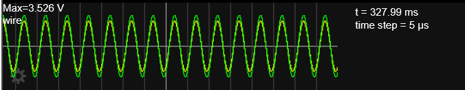
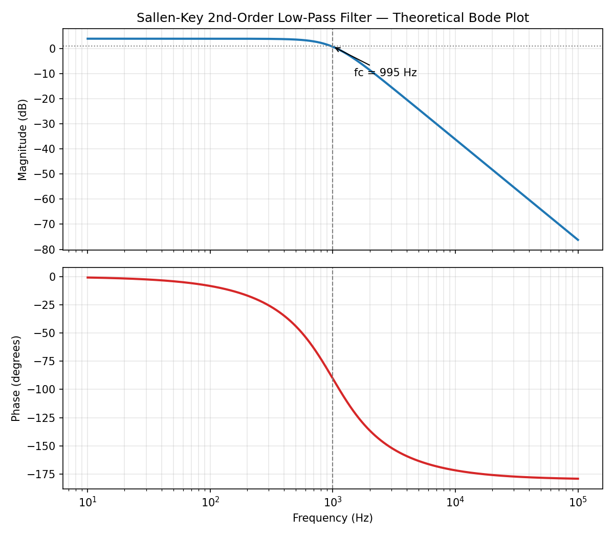

# Sallen-Key 2nd-Order Active Low-Pass Filter

A Butterworth-response Sallen-Key active low-pass filter, designed with a
1 kHz cutoff frequency, simulated in [Falstad's online circuit simulator](https://www.falstad.com/circuit/),
and cross-checked against the theoretical transfer function in Python.



## Why Sallen-Key?

The Sallen-Key topology is one of the most common active filter structures
used in real analog design because it achieves a 2nd-order (-40 dB/decade)
rolloff using a single op-amp, rather than requiring multiple cascaded
stages or inductors (which are bulky, lossy, and hard to source at low
frequencies). It's a standard building block in audio circuits, anti-aliasing
filters ahead of ADCs, and signal conditioning stages.

## Design Goal

- **Filter type:** 2nd-order low-pass, Butterworth (maximally flat, Q = 0.707)
- **Cutoff frequency (fc):** 1 kHz
- **Topology:** Equal-component Sallen-Key (R1 = R2, C1 = C2)

## Design Equations

For the equal-R, equal-C Sallen-Key low-pass filter:

```
fc = 1 / (2*pi*R*C)
K  = 1 + Rf/Rg          (non-inverting gain set by feedback divider)
Q  = 1 / (3 - K)
```

For a Butterworth response, Q must equal 0.707, which requires K = 1.586.

## Component Selection

| Component | Value | Notes |
|---|---|---|
| R1, R2 | 16 kOhm | Sets cutoff together with C1, C2 |
| C1, C2 | 10 nF | Standard, stable value |
| Rg | 10 kOhm | Sets gain (denominator of feedback divider) |
| Rf | 5.6 kOhm | Sets gain (nearest standard value to ideal 5.86 kOhm) |
| Op-amp | TL072 (ideal, in sim) | Low-noise, common for audio-frequency analog design |

**Calculated performance (see `bode_plot.py`):**
- fc = 994.7 Hz (~1 kHz, as targeted)
- Gain K = 1.560
- Q = 0.694 (close to the ideal 0.707 -- the small deviation comes from
  rounding Rf/Rg to standard resistor values instead of the exact
  5.86 kOhm)

## Circuit Diagram

Built and simulated in Falstad's circuit simulator. Signal path:

```
Vin -> R1 -> R2 -> op-amp (+)
              |
             C1 -> GND        (from R1/R2 junction)
              |
             C2 -> op-amp output   (feedback loop, R1/R2 junction to output)

op-amp output -> Rf -> Rg -> GND   (feedback divider into op-amp (-) input)
```

The raw circuit file is included as `sallen_key_filter.txt` -- this can be
imported directly into Falstad via **File -> Import from Text**.

## Simulation Results

Verified in Falstad by sweeping the AC source frequency and observing the
output amplitude on the scope:

| Frequency | Behavior |
|---|---|
| 100 Hz | Output ~ full input amplitude (passband) |
| 1 kHz | Output ~ 70% of input amplitude (-3 dB point, matches design) |
| 10 kHz | Output amplitude significantly attenuated (stopband) |

This matches the theoretical Bode plot generated by `bode_plot.py`:



## Files

- `sallen_key_filter.txt` -- Falstad circuit export (importable text format)
- `circuit_schematic.png` -- Screenshot of the simulated circuit
- `bode_plot.py` -- Python script computing and plotting the theoretical
  magnitude/phase response from the transfer function
- `bode_plot.png` -- Output of the above script

## Real-World PCB Considerations

A few things that matter when moving this from simulation to a physical
board:

- **Op-amp choice:** A real op-amp (e.g. TL072) has finite gain-bandwidth
  product (~3 MHz for TL072), input bias current, and slew rate limits.
  At 1 kHz cutoff these are not concerns, but they would matter for a
  much higher cutoff frequency design.
- **Component tolerance:** Standard resistors/capacitors are typically
  5-10% tolerance, which will shift fc and Q slightly from the ideal
  design. For tighter tolerance applications, 1% resistors and C0G/NP0
  capacitors (which are much more stable than ceramic X7R types) are
  preferred.
- **Power supply decoupling:** The op-amp's supply pins need decoupling
  capacitors (typically 0.1 uF ceramic close to the package) to avoid
  noise coupling into the filter output.
- **Grounding:** Keep the feedback network (Rf/Rg) physically close to the
  op-amp to minimize noise pickup, and use a solid ground plane if
  possible.

## How to Reproduce

1. Open [falstad.com/circuit](https://www.falstad.com/circuit/)
2. File -> Import from Text -> paste contents of `sallen_key_filter.txt`
3. Click RUN, then vary the AC source frequency to observe the filter
   response on the scope
4. Run `python bode_plot.py` (requires `numpy`, `matplotlib`) to regenerate
   the theoretical Bode plot
